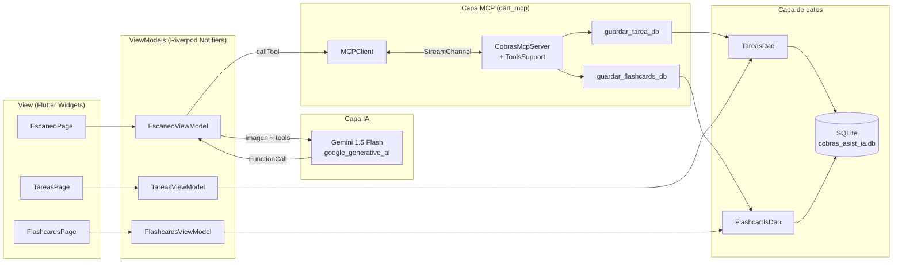
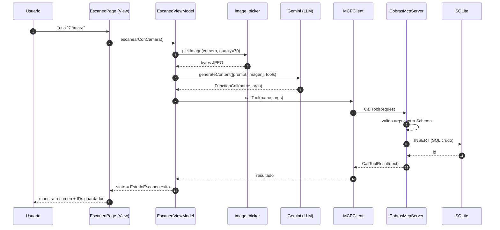

# CobrasAsistIA

> Aplicación móvil educativa (Flutter) para estudiantes de preparatoria.
> Escanea tus apuntes o el pizarrón con la cámara: la **IA multimodal de Gemini**
> los analiza y, a través del **Model Context Protocol (MCP)**, ejecuta
> herramientas locales que guardan tareas pendientes y flashcards de estudio en
> una base de datos **SQLite** en el dispositivo.

Este proyecto es un ejemplo didáctico para aprender a integrar **Flutter + MCP + LLMs multimodales + SQLite** siguiendo una arquitectura **MVVM** con **Riverpod**.

---

## ✨ Características principales

- 📷 Captura de imagen (cámara o galería) con `image_picker`.
- 🤖 Análisis multimodal (texto + imagen) con Gemini 1.5 Flash.
- 🔌 Servidor MCP **in-process** que expone dos herramientas locales:
  - `guardar_tarea_db` — registra una tarea pendiente.
  - `guardar_flashcards_db` — registra una o varias flashcards.
- 🗄️ Persistencia con `sqflite` usando **SQL puro** (sin ORM).
- 🧩 Arquitectura **MVVM** con Riverpod (`Notifier` / `AsyncNotifier`).
- 🔐 API key de Gemini cargada desde `.env` (ignorado por git).

---

## 🏛️ Arquitectura



### Patrón MVVM

| Capa | Responsabilidad | Implementación |
|---|---|---|
| **View** | Renderizar estado, capturar gestos. Sin lógica de negocio. | `lib/view/*` |
| **ViewModel** | Orquestar casos de uso, exponer estado inmutable. | `lib/view_model/*` (Riverpod `Notifier`) |
| **Model / Data** | Persistencia y herramientas locales. | `lib/data/`, `lib/mcp_tools/` |

---

## 🔄 Flujo de "Escaneo de Apuntes"



**Punto clave (pedagogía):** el LLM **nunca** ejecuta código. Solo solicita
una herramienta por nombre. Es el servidor MCP local el que ejecuta el `INSERT`
en SQLite. Esto es lo que hace al protocolo seguro y auditable.

---

## 📁 Estructura del proyecto

```
lib/
├── main.dart                         # Bootstrap: carga .env + ProviderScope
├── app.dart                          # MaterialApp + tema
├── core/
│   └── providers.dart                # Providers globales de Riverpod
├── data/
│   └── database/
│       ├── app_database.dart         # Helper sqflite (CREATE TABLE)
│       ├── tareas_dao.dart           # INSERT/SELECT con SQL puro
│       └── flashcards_dao.dart
├── mcp_tools/
│   ├── cobras_mcp_server.dart        # MCPServer + ToolsSupport
│   ├── mcp_channel.dart              # StreamChannelController in-process
│   └── tools/
│       ├── guardar_tarea_tool.dart
│       └── guardar_flashcards_tool.dart
├── view_model/
│   ├── escaneo_view_model.dart       # Notifier: cámara → Gemini → MCP
│   ├── tareas_view_model.dart        # AsyncNotifier: lista tareas
│   └── flashcards_view_model.dart
└── view/
    ├── home_page.dart                # Tabs Escanear / Tareas / Flashcards
    ├── escaneo_page.dart
    ├── tareas_page.dart
    └── flashcards_page.dart
```

---

## 📦 Dependencias

| Paquete | Versión | Rol pedagógico |
|---|---|---|
| `flutter_riverpod` | ^2.5.1 | ViewModels (MVVM) y DI |
| `dart_mcp` | 0.5.1 | Servidor MCP con `ToolsSupport` |
| `stream_channel` | ^2.1.2 | Canal in-process cliente↔servidor MCP |
| `google_generative_ai` | ^0.4.6 | Cliente Gemini (multimodal + tool use) |
| `sqflite` | ^2.4.0 | SQLite con SQL crudo |
| `path` | ^1.9.0 | Resolución del path de la BD |
| `path_provider` | ^2.1.4 | Directorio de documentos del dispositivo |
| `image_picker` | ^1.1.2 | Captura de imagen (cámara + galería) |
| `flutter_dotenv` | ^5.2.1 | Carga de `.env` (API key) |
| `supabase_flutter` | ^2.8.0 | *Placeholder* para sincronización futura |

---

## 🔧 Herramientas MCP registradas

| Tool | Argumentos requeridos | Argumentos opcionales | Efecto |
|---|---|---|---|
| `guardar_tarea_db` | `titulo` | `descripcion`, `materia`, `fecha_entrega` | INSERT en `tareas` |
| `guardar_flashcards_db` | `tarjetas` (array de `{pregunta, respuesta}`) | `materia`, `tema`, `dificultad` por tarjeta | INSERT batch en `flashcards` (transacción) |

`ToolsSupport.registerTool` valida automáticamente los argumentos contra el
`Schema` MCP **antes** de invocar el handler — un buen ejemplo de la
robustez que aporta el protocolo.

---

## 🗃️ Esquema de SQLite

```sql
CREATE TABLE tareas (
  id            INTEGER PRIMARY KEY AUTOINCREMENT,
  titulo        TEXT    NOT NULL,
  descripcion   TEXT,
  materia       TEXT,
  fecha_entrega TEXT,            -- ISO-8601
  creada_en     TEXT    NOT NULL
);

CREATE TABLE flashcards (
  id          INTEGER PRIMARY KEY AUTOINCREMENT,
  pregunta    TEXT    NOT NULL,
  respuesta   TEXT    NOT NULL,
  materia     TEXT,
  tema        TEXT,
  dificultad  INTEGER DEFAULT 1, -- 1..5
  creada_en   TEXT    NOT NULL
);
```

---

## 🚀 Cómo correrlo

1. **Instala dependencias**
   ```bash
   flutter pub get
   ```

2. **Configura tu API key de Gemini**
   ```bash
   cp .env.example .env
   ```
   Edita `.env` y pega tu key de https://aistudio.google.com/apikey

3. **Ejecuta en un dispositivo o emulador**
   ```bash
   flutter run
   ```

> ⚠️ `flutter run` en navegador no es ideal: `sqflite` y `image_picker` con
> cámara funcionan mejor en Android/iOS reales (o emulador con cámara).

---

## ➕ Cómo agregar una nueva herramienta MCP

1. **Crea el archivo** `lib/mcp_tools/tools/mi_tool.dart` con:
   - `mcp.Tool miToolMcp = mcp.Tool(name: ..., inputSchema: mcp.Schema.object(...))`
   - `gemini.FunctionDeclaration miToolGemini = gemini.FunctionDeclaration(...)`
2. **Regístralo** en `CobrasMcpServer.fromStreamChannel`:
   ```dart
   registerTool(miToolMcp, _onMiTool);
   ```
   y agrega el handler `_onMiTool(CallToolRequest) → FutureOr<CallToolResult>`.
3. **Exponlo a Gemini** agregándolo a la lista en `obtenerToolsParaGemini()` en
   `lib/mcp_tools/mcp_channel.dart`.

---

## 🧪 Verificación

- `flutter analyze` — sin errores.
- `flutter test` — corre el test unitario que verifica el registro de tools.
- **Prueba E2E manual:**
  1. Escribe en una hoja: *"Tarea: leer capítulo 3 de biología para el viernes"*.
  2. Toma foto desde la pestaña **Escanear**.
  3. Verifica que aparezca en la pestaña **Tareas**.
- Lo mismo con definiciones del estilo *"Mitocondria: orgánulo que produce energía"* → debe aparecer en **Flashcards**.

---

## 📚 Lecturas recomendadas

- [Model Context Protocol — Especificación](https://modelcontextprotocol.io/)
- [Paquete `dart_mcp`](https://pub.dev/packages/dart_mcp)
- [`google_generative_ai` — Function calling](https://pub.dev/packages/google_generative_ai)
- [Riverpod — Notifiers](https://riverpod.dev/)
